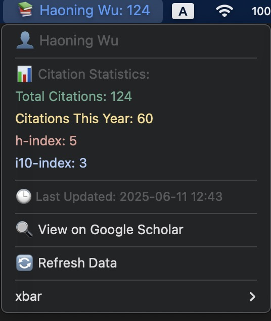
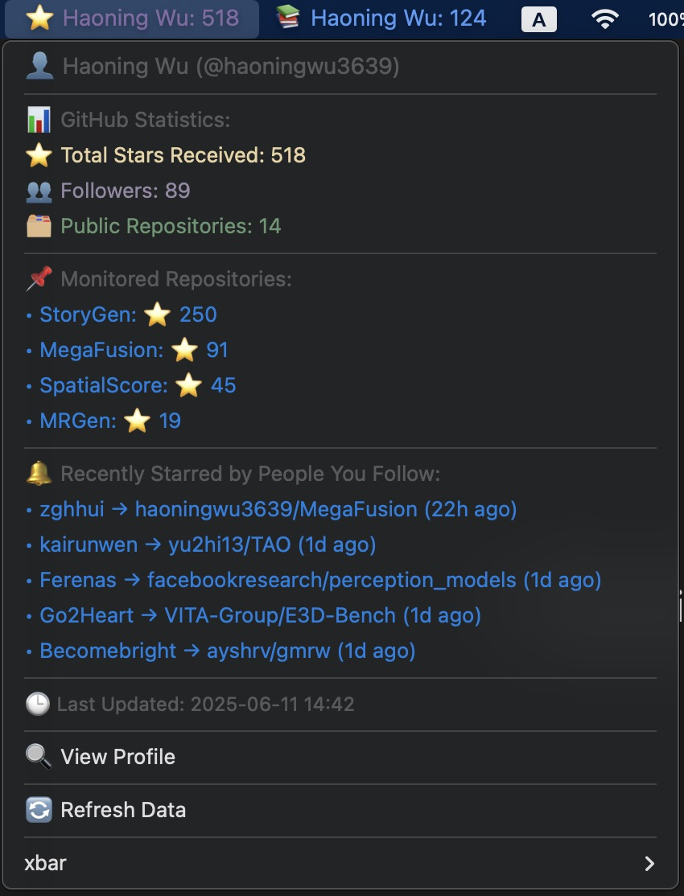

# Google Scholar & Github Profile Monitor (xbar Plugin)

## Motivations
- I used to habitually check my Personal Webpage, GitHub and Google Scholar profiles once a day. Thus, I built this plugin using Python and xbar to motivate myself to work harder.
- 考虑到自己每天会习惯性地打开一次自己的主页，GitHub和Google scholar，我用上班摸鱼的时间基于python和xbar写了一个桌面导航栏的小插件，用来督促自己努力工作。

## Preview
<p align="center">
  
  
</p>

## Dependencies
- [xbar](https://github.com/matryer/xbar) (Recommend installing via [Homebrew](https://brew.sh/))
- [SERP API](https://serpapi.com/dashboard) (To obtain API for crawling information from Google Scholar)
- [Github API](https://github.com/settings/tokens) (To obtain API for crawling your Github profile)
- Python >= 3.6
- requests
- beautifulesoup4
- python-dotenv

## Get Started
1. Install xbar via Homebrew (I used MacOS):
```
brew install --cask xbar
```

2. Clone this repository to xbar plugins folder:

```
# Create the default xbar plugin directory if it doesn't exist.
mkdir ~/Library/Application\ Support/xbar/plugins/
git clone [https://github.com/haoningwu3639/ProfileMonitor.git] ~/Library/Application\ Support/xbar/plugins/
# Remember to place the python scripts under ** xbar/plugins/ **.
```

3. Install python dependencies:
```
pip install requests beautifulsoup4 python-dotenv
```

4. Register and replace your own token of SERP API (for Google Scholar) and Github API.
```
# Code in github.1h.py
# GitHub API Configuration
GITHUB_USERNAME = os.getenv("GITHUB_USERNAME", "YourGithubUserNameHere") # Replace with your GitHub username
GITHUB_TOKEN = os.getenv("GITHUB_TOKEN", "YourGithubTokenHere")  # Personal Access Token with appropriate permissions

# Code in scholar.4h.py
# You need to register for SERP API and get an API key: https://serpapi.com/
SERP_API_KEY = os.getenv("SERP_API_KEY", "YourSERPAPIKeyHere") # SERP API Key
SCHOLAR_ID = os.getenv("SCHOLAR_ID", "YourGoogleScholarIDHere")  # Google Scholar ID

```

5. Make the script executable:
```
chmod +x github.1h.py
chmod +x scholar.4h.py
```

6. Restart xbar to see the monitors in your menu bar!
- I have set the default refresh frequency to 1 hour and 4 hours for Github Profile and Google Scholar Profile, respectively. You can modify these by yourself.

## Misc
Currently only tested on macOS. Windows/Linux compatibility not verified.

**If you find this plugin useful or interesting, please give a star!**

Also, welcome to contribute code to make it more perfect.


## Acknowledgements
Many thanks to the awesome open-sourced software [xbar](https://github.com/matryer/xbar).

## Contact
If you have any questions, please feel free to contact haoningwu3639@gmail.com.
